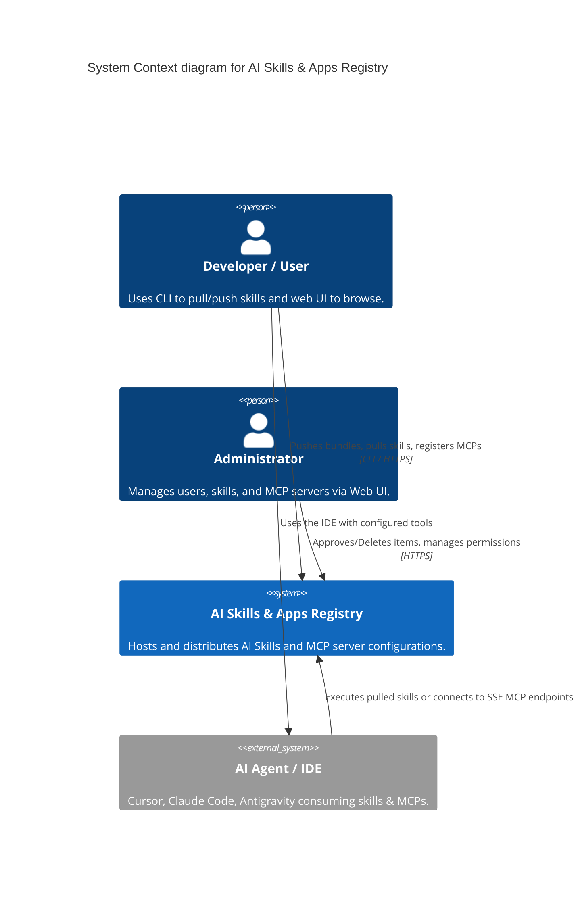
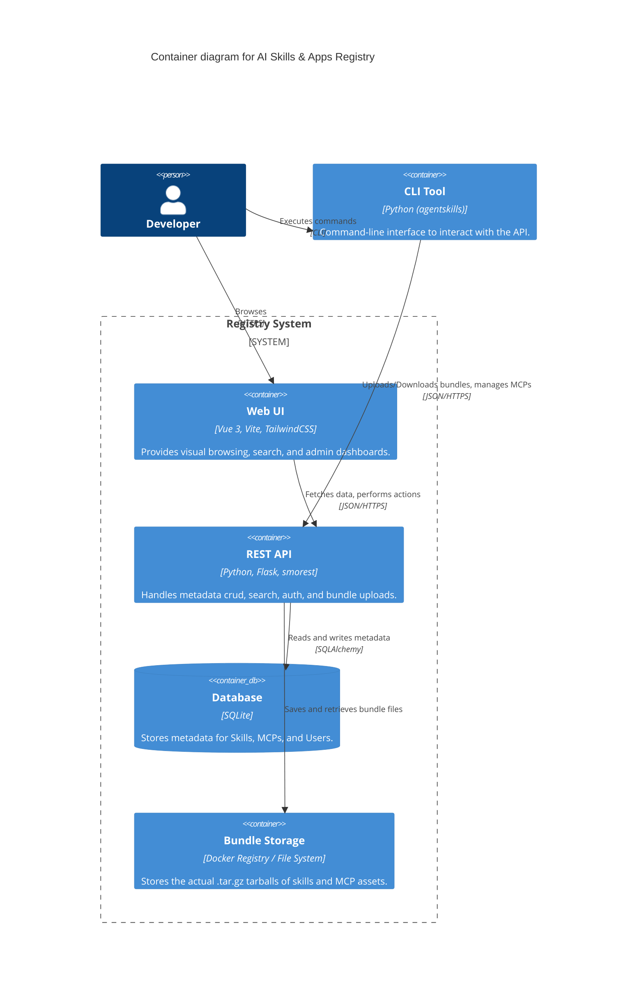

# AI Skills & Apps Registry - 軟體設計文件 (SDD)

## 1. 系統概覽
本系統主要提供一個集中式的 Registry，讓開發者上傳與下載 AI Agent 所使用的腳本技能 (Skills) 與 Model Context Protocol (MCP) Servers。
系統包含三大核心：**後端 REST API** (Python Flask)、**前端 Web UI** (Vue 3) 以及 **命令列工具 CLI** (Python)。

## 2. 架構設計

### 2.1 C4 Model - Context Diagram

### 2.2 C4 Model - Container Diagram

## 3. 元件設計
### 3.1 Registry API (`packages/registry-api`)
- **Web Framework**: Flask + Flask-Smorest (自動產出 OpenAPI/Swagger 文件)。
- **ORMLayer**: Flask-SQLAlchemy 處理 SQLite/PostgreSQL 連線。
- **Authentication**: JWT token 機制 (`auth.py`) 處理登入與權限檢查 (`@jwt_required()`)。
- **Routing**: 分為 `auth`, `skills`, `mcps`, `admin`, `docker` 五大模組。

### 3.2 Web UI (`packages/registry-ui`)
- **Framework**: Vue 3 (Composition API) + Vite。
- **State Management**: Pinia (管理使用者登入狀態、角色與 API Token)。
- **Styling**: Tailwind CSS + 自訂樣式，搭配英雄區塊與暗黑模式元素。
- **API Client**: Axios 封裝，自動夾帶 JWT Authorization Header。

### 3.3 CLI Tool (`packages/cli`)
- **Package**: `agentskills` (以 `setuptools` 安裝)。
- **Core logic**: 封裝 API 呼叫、處理 `tar.gz` 打包解壓縮、讀取/寫入全域 IDE 設定檔 (例如 `~/.claude/claude.json` 寫入 MCP 設定)。

## 4. 資料設計
- 採用 **SQLite** 於本地/單點部署提供輕量級持久化方案。透過 volume mount 綁定 `/app/data/registry.db`。
- MCP 伺服器與技能的 metadata (如 `name`, `version`, `tags`, `tools` 列表) 統一存放在關聯式資料庫中，而打包的二進位檔案則單獨存放在 File System (Bundle Storage)。

## 5. 安全設計
- **認證授權**：API 發行 JWT，CLI 與前端需持有 Token 才可操作寫入動作。
- **權限控制 (RBAC)**：資料表 User 有 `role` 與 `permissions` 欄位。Admin API 具備防護，僅限 `admin` 角色存取。
- **防禦**：使用 CORS 限制跨域請求來源，上傳檔案副檔名限制與 Payload size limit。

## 6. 錯誤處理策略
- API 統一回傳標準 HTTP 狀態碼：`400 Bad Request` (格式錯誤), `401 Unauthorized` (未登入), `403 Forbidden` (無權限), `404 Not Found`。
- CLI 在遭遇錯誤時會輸出紅色錯誤提示，並安全終止，不會遺留半成品設定檔。
