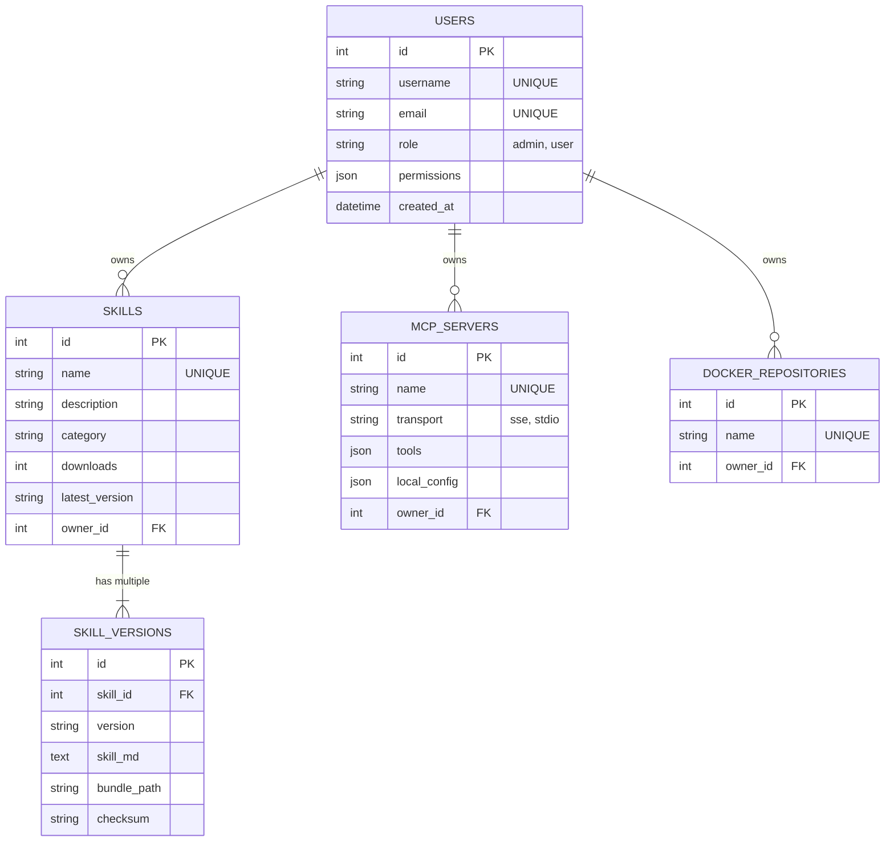

# AI Skills & Apps Registry - Table Schema (資料庫文件)

## 1. 資料庫概覽
- **資料庫類型**: SQLite (本地開發/單點部署) / 支援切換 PostgreSQL。
- **連線字串**: 透過環境變數 `DATABASE_URL` 指定，預設存放於 `/app/data/registry.db`。
- **ORM 管理**: SQLAlchemy 與 Flask-Migrate (Alembic) 處理資料庫遷移。

## 2. 命名規範
- 資料表統一使用**複數名詞**、小寫、底線分隔 (如 `skills`, `users`)。
- 主鍵命名為 `id` (Integer Auto-increment)。
- 建立/更新時間統一命名為 `created_at` 與 `updated_at` (UTC時區)。

## 3. 核心資料表目錄

### 3.1 `users`
**用途說明**: 儲存 Registry 使用者、開發者與管理員的帳號資料。
- `id` (Integer): PK
- `username` (String): 唯一使用者名稱。
- `email` (String): 唯一信箱。
- `api_token_hash` (String): 用於 CLI 登入的憑證 Hash。
- `role` (String): 角色權限 (`admin`, `maintainer` 或預設 `user`)。
- `permissions` (JSON): 權限清單陣列陣列。
- `created_at` (DateTime): 建立時間。

### 3.2 `skills`
**用途說明**: 儲存平台上發布的 AI Agent 技能 / 工具元資料。
- `id` (Integer): PK
- `name` (String): 唯一技能名稱識別碼。
- `description` (Text): 簡介。
- `author` (String): 作者名稱。
- `license` (String): 授權條款 (MIT, Apache 等)。
- `repository` (String): 原始碼 GitHub 連結。
- `examples` (JSON): 提示詞使用範例陣列。
- `tags` (JSON): 標籤陣列。
- `category` (String): 技能分類，建立索引加速搜尋。
- `downloads` (Integer): 累計下載與安裝次數。
- `latest_version` (String): 最新版本號。
- `owner_id` (Integer): FK 關聯至 `users.id`。

### 3.3 `skill_versions`
**用途說明**: 儲存單一技能的不同歷史版本，並與實際 Bundle 檔案對應。
- `id` (Integer): PK
- `skill_id` (Integer): FK 關聯至 `skills.id`。
- `version` (String): 版本號字串 (如 `1.0.0`)。
- `skill_md` (Text): 該版本的 `SKILL.md` 指令與內容。
- `bundle_path` (String): 對應儲存在檔案系統的 `.tar.gz` 路徑。
- `checksum` (String): SHA256 驗證碼。
- **約束條件**: Unique Constraint (`skill_id`, `version`)。

### 3.4 `mcp_servers`
**用途說明**: 儲存 Model Context Protocol (MCP) Server 的登錄與連線配置。
- `id` (Integer): PK
- `name` (String): 唯一識別碼。
- `display_name` (String): 顯示名稱。
- `description` (Text): 工具用途描述。
- `author` (String): 作者名稱。
- `endpoint_url` (String): 若為 `sse` 類型，對應的反向代理或遠端 URL。
- `transport` (String): 傳輸協定 (`sse`, `stdio`, `http`)。
- `local_config` (JSON): 若為 `stdio` 類型，存在本地如何以 docker, npx 或 pip 啟動的指令配置。
- `tools` (JSON): 該 MCP 伺服器所公開提供的工具 (Tool) 列表 (內含 name, description)。
- `installs` (Integer): 安裝數量。
- `owner_id` (Integer): FK 關聯至 `users.id`。

## 4. ERD 實體關係圖

